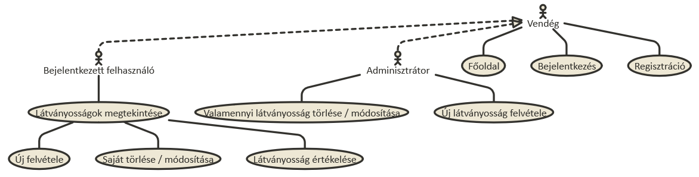
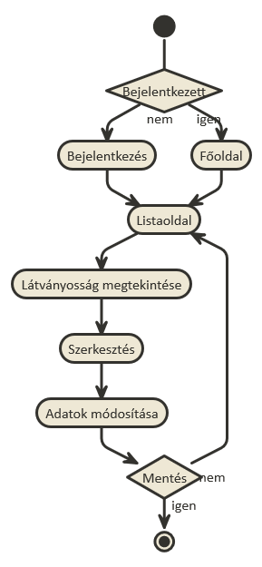

#Dokumentáció

##Látványosságok
Készítette: Madák Ildikó

###1. Követelményanalízis
####1.1 Célkitűzés
Az alkalmazás célja megjeleníteni a felhasználók által beküldött látványosságok adatait. Az adatok védelme érdekében lehetőség van regisztrációra, majd bejelentkezésre. Bejelentkezett felhasználó új helyszíneket adhat hozzá a már meglévőkhöz, lehetősége van értékelni a mások által beküldött helyszíneket, valamint az önmaga által beküldötteket módosítani, törölni.
Az adminisztrátornak lehetősége van bármely beküldött helyszínt módosítani, vagy akár törölni.

####Funkcionális követelmények
* Vendégek által elérhető funkciók
  - Regisztráció
  - Bejelentkezés
  - A főoldalon megtekinteni a legjobb értékelésű nevezetességeket
  - Látványosságok között szűrni név, elhelyezkedés alapján
* Bejelentkezett felhasználók által elérhető funkciók
  - Új látványosság hozzáadása
  - Látványosságok értékelése
  - Saját látványosság adatainak módosítása
  - Saját látványosság törlése
* Admin felhasználó által elérhető funkciók
  - Bármely látványosság törlése
  - Bármely látványosság adatainak módosítása
  - Új látványosság hozzáadása

####Nem funkcionális követelmények
- Könnyű áttekinthetőség: színek használata a keresés megkönnyítéséhez, ésszerű elrendezés, hibásan bevitt adatok esetén a hiba egyértelmű jelzése
- Megbízhatóság: jelszóval védett funkciók

####1.2 Szakterületi fogalomjegyzék
- **Nehézség:** túrák osztályozása fizikai szükséglet szerint.
Például egy hegyvidéki kilátó több ponttal rendelkezik mint egy kis túraútvonal a völgyben
- **Jelleg:** a nevezetesség csoportosítása célcsoport, tematika szerint 
Például megkülönböztet tanösvényeket, múzeumokat, szabadidős programokat

####1.3 Használatieset-modell, funkcionális követelmények
- **Vendég:** Csak a publikus oldalakat éri el: főoldal, bejelentkezés, regisztráció
- **Bejelentkezett felhasználó:** A publikus oldalak elérésén kívül egyéb funkciókhoz is hozzájut: új nevezetesség felvétele, meglévő nevezetesség törlése/módosítása/értékelése
- **Bejelentkezett adminisztrátor:** Bármelyik nevezetességet módosíthatja, törölheti vagy új látványosságokat vehet fel.

#####Egy folyamat szemléltetése:
**Meglévő látványosság szerkesztése:**
1. A felhasználó az oldalon bejelentkezik, ha nincs regisztrálva akkor regisztrál.
2. Bejelentkezés után megtekintheti az általa hozzáadott látványosságokat.
3. Kiválaszt egyet, ehhez megnyomja a "Megtekintés" feliratú gombot.
4. A megtekintés oldalon kiválaszthatja a "Szerkesztés" gombot
5. A szerkesztés oldalon módosíthatja a leírást.
6. "Mentés" gombra kattintva elmenti a változásokat.

